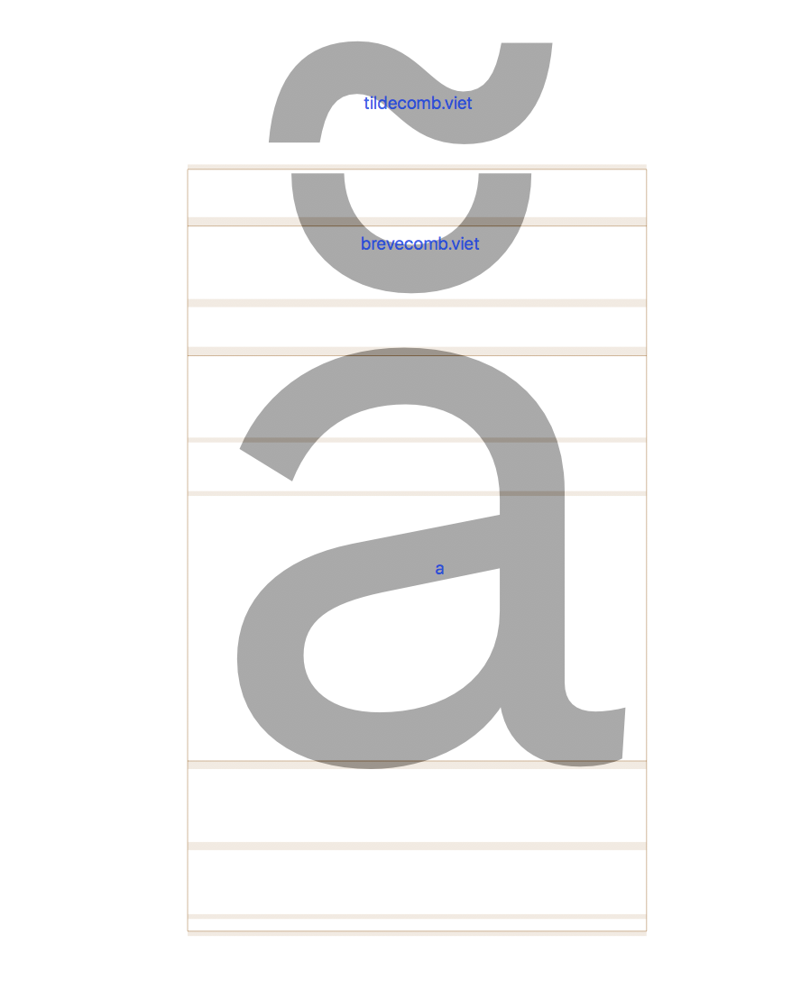

# Show Component Name

*This is a plugin for the [Glyphs font editor](http://glyphsapp.com/).*  

It shows the name of each component in the current glyph in the edit view.

### Install

1. Install via the Plugin Manager in Glyphs.
2. Restart Glyphs.

### How to use

When ever you need it, toggle `Show Component Name` from the view menu.

### Examples

##### Pull Requests

Feel free to comment or pull requests for any improvements.

##### License

Copyright 2018 Wei Huang

Made possible with the GlyphsSDK by Georg Seifert (@schriftgestalt) and Rainer Erich Scheichelbauer (@mekkablue).

Licensed under the Apache License, Version 2.0 (the "License");
you may not use this file except in compliance with the License.
You may obtain a copy of the License at

http://www.apache.org/licenses/LICENSE-2.0

See the License file included in this repository for further details.